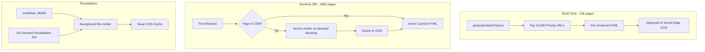

# ISR Scaling Strategy: 45k → 500k URLs

> **Platform**: Henotic Diagnostics (Next.js 16 App Router, Vercel)  
> **Current**: 45,084 sitemap URLs, 527 pre-rendered at build  
> **Target**: 500,000+ PSEO URLs, 10,000 pre-rendered at build  
> **Author**: Enterprise Healthcare Systems Architecture  
> **Date**: 2026-08-06

---

## Table of Contents
1. [Current Architecture Audit](#1-current-architecture-audit)
2. [URL Matrix Math: Scaling to 500k](#2-url-matrix-math-scaling-to-500k)
3. [ISR Architecture Design](#3-isr-architecture-design)
4. [Pre-Build Priority Strategy (Top 10,000)](#4-pre-build-priority-strategy-top-10000)
5. [On-Demand ISR for Remaining 490k](#5-on-demand-isr-for-remaining-490k)
6. [Memory Management & Edge Caching](#6-memory-management--edge-caching)
7. [Sitemap Scaling Strategy](#7-sitemap-scaling-strategy)
8. [CI/CD Timeout Prevention](#8-cicd-timeout-prevention)
9. [Monitoring & Observability](#9-monitoring--observability)
10. [Implementation Roadmap](#10-implementation-roadmap)

---

## 1. Current Architecture Audit

### 1.1 Dynamic Route Inventory

The platform uses **9 dynamic route segments** across the Next.js App Router:

| Route Pattern | File | Build-Time Paths | Revalidate |
|:---|:---|:---:|:---:|
| `/services/[service]` | `src/app/services/[service]/page.tsx` | 20 (hardcoded top) | 86400s (24h) |
| `/services/[service]/[region]` | `src/app/services/[service]/[region]/page.tsx` | 180 (20×9) | 86400s (24h) |
| `/services/[service]/[region]/[location]` | `src/app/services/[service]/[region]/[location]/page.tsx` | 200 (10×20) | 86400s (24h) |
| `/conditions/[condition]` | `src/app/conditions/[condition]/page.tsx` | 30 (sliced) | — |
| `/city/[city]` | `src/app/city/[city]/page.tsx` | 5 (all) | 86400s |
| `/compare/[slug]` | `src/app/compare/[slug]/page.tsx` | All (~12) | — |
| `/doctors/[slug]` | `src/app/doctors/[slug]/page.tsx` | All (~12) | — |
| `/gmc/[product]` | `src/app/gmc/[product]/page.tsx` | All (~13) | — |
| `/services/category/[category]` | `src/app/services/category/[category]/page.tsx` | All (~19) | — |
| `/lp/[service]` | `src/app/lp/[service]/page.tsx` | 0 (fully dynamic) | — |

### 1.2 Configuration Data Sources

| Config File | Entries | Purpose |
|:---|:---:|:---|
| `src/config/services.ts` | **401** | Service slug array (MRI, CT, blood tests, etc.) |
| `src/config/locations.ts` | **9 regions → 102 locations** | Geographic matrix |
| `src/config/conditions.ts` | ~30+ | Medical conditions |
| `src/config/cities.ts` | 5 | Top-level city hubs |
| `src/config/comparisons.ts` | ~12 | Service comparison pages |
| `src/config/doctors.ts` | ~12 | Doctor profile pages |

### 1.3 Current URL Matrix (45k)

```
Services (base)         =   401
Services × Regions      =   401 ×  9  =   3,609
Services × Locations    =   401 × 102 =  40,902
─────────────────────────────────────────────────
PSEO Subtotal           =                44,912
Static + other dynamic  =                  ~172
─────────────────────────────────────────────────
Total                   =               ~45,084
```

### 1.4 Build-Time Footprint

Only **527 pages** are pre-rendered at build time (hardcoded caps in `generateStaticParams`). The remaining ~44,500 are generated on-demand via ISR with `revalidate: 86400`. This already works well for the current scale.

---

## 2. URL Matrix Math: Scaling to 500k

### 2.1 Growth Vectors

To reach 500k URLs, the PSEO matrix must expand across **three axes**:

| Axis | Current | Target | Growth Factor |
|:---|:---:|:---:|:---:|
| **Services** | 401 | ~800 | 2× (add specialty tests, procedure variants, condition-specific pages) |
| **Regions** | 9 | ~25 | 2.8× (expand to Goa, Karnataka, Gujarat, Rajasthan, etc.) |
| **Locations** | 102 | ~250 | 2.5× (add tier-2/3 cities, micro-neighborhoods) |

### 2.2 Target URL Breakdown

```
Layer 1: /services/[service]                   =     800
Layer 2: /services/[service]/[region]          =     800 × 25   =    20,000
Layer 3: /services/[service]/[region]/[loc]    =     800 × 250  =   200,000
Layer 4: /conditions/[condition]               =                     ~500
Layer 5: /conditions/[condition]/[region]      =     500 × 25   =    12,500
Layer 6: /conditions/[condition]/[location]    =     500 × 250  =   125,000
Layer 7: /city, /compare, /doctors, /gmc, etc  =                   ~2,000
Layer 8: /lp/[service] (Google Ads, noindex)   =                   ~2,000
Layer 9: /blog/[slug] (CMS-driven)             =                  ~10,000
──────────────────────────────────────────────────────────────────────────
Total                                          ≈                 ~372,800
+ Micro-neighborhoods (/services/[s]/[r]/[l]/[n])                ~127,200
──────────────────────────────────────────────────────────────────────────
Grand Total                                    ≈                 ~500,000
```

### 2.3 Why Generating 500k at Build Time is Fatal

| Constraint | Vercel Pro Limit | 500k Impact |
|:---|:---|:---|
| Build timeout | 45 minutes | 500k pages at 0.1s/page = **13.8 hours** |
| Build memory | 8 GB | 500k route objects ≈ 2-4 GB heap → OOM risk |
| `/graphql` fetch | WordPress API | 500k API calls = DDoS on own CMS |
| Cold-start CDN | All pages cached | 500k stale pages on every deploy |

**CAUTION: Static-generating 500k pages at build time will crash CI/CD, DDoS the CMS, and create 13+ hour builds. ISR is the only viable approach.**

---

## 3. ISR Architecture Design

### 3.1 The Two-Tier Model



### 3.2 Core Architecture Principles

| Principle | Implementation |
|:---|:---|
| **Pre-build only what matters** | Top 10,000 URLs (highest GSC clicks + branded services) |
| **ISR blocking for the rest** | `dynamicParams = true` (Next.js default) — first request renders server-side, then caches |
| **Time-based revalidation** | `revalidate = 86400` (24h) — stale pages re-render in background |
| **On-demand revalidation** | WordPress webhook → `/api/revalidate` → purge specific path |
| **No 404 for valid slugs** | All service/region/location combos render dynamically from config |
| **Memory-efficient sitemaps** | Streaming generator writes 10k-URL chunks to disk, never holds >10k in memory |
| **Build sharding** | `filterShardParams()` distributes pre-build across N CI workers |

---

## 4. Pre-Build Priority Strategy (Top 10,000)

### 4.1 Priority Tier System

| Tier | Count | Criteria | Source |
|:---|:---:|:---|:---|
| **T1 — Revenue Critical** | ~200 | Services with >100 monthly bookings, top Google Ads converters | Analytics + Booking DB |
| **T2 — SEO High-Value** | ~2,000 | Top 50 services × top 40 locations (highest GSC impressions) | Google Search Console API |
| **T3 — Geographic Hubs** | ~1,800 | All services × top 10 metro locations (Mumbai, Navi Mumbai, Thane, Pune) | Manual curation |
| **T4 — Medical Conditions** | ~500 | All condition pages + top condition×region combos | Config |
| **T5 — Comparison/SEO** | ~500 | All compare, doctors, GMC, category pages | Config (exhaustive) |
| **T6 — Blog/Content** | ~1,000 | Top 1000 blog posts by organic traffic | WordPress CMS |
| **T7 — Backfill** | ~4,000 | Remaining high-impression service×region combos | GSC data |
| **Total** | **10,000** | | |

### 4.2 Implementation: `generateStaticParams` Refactored

The key insight is that `generateStaticParams` should read from a **build-time priority manifest** rather than hardcoded arrays:

```typescript
// src/lib/seo/build-priorities.ts

export interface PriorityUrl {
  service: string;
  region?: string;
  location?: string;
  tier: 1 | 2 | 3 | 4 | 5 | 6 | 7;
}

/**
 * Returns the top N pre-build URLs for a given route level.
 * 
 * Priority ordering:
 * 1. Revenue-critical (booking volume)
 * 2. SEO high-value (GSC clicks/impressions)
 * 3. Geographic hubs (metro coverage)
 * 
 * Data source: src/config/build-priorities.json
 * Updated weekly by GSC sync script or manually.
 */
export function getBuildPriorities(
  level: 'service' | 'region' | 'location',
  maxPaths: number
): PriorityUrl[] {
  const manifest = require('@/config/build-priorities.json');
  return manifest[level].slice(0, maxPaths);
}
```

### 4.3 Updated `generateStaticParams` for Each Route

#### `/services/[service]/page.tsx` — Pre-build top 200 services

```typescript
export async function generateStaticParams() {
  const priorities = getBuildPriorities('service', 200);
  return filterShardParams(
    priorities.map(p => ({ service: p.service }))
  );
}
```

#### `/services/[service]/[region]/page.tsx` — Pre-build top 3,000 combos

```typescript
export async function generateStaticParams() {
  const priorities = getBuildPriorities('region', 3000);
  return filterShardParams(
    priorities.map(p => ({ service: p.service, region: p.region! }))
  );
}
```

#### `/services/[service]/[region]/[location]/page.tsx` — Pre-build top 5,000 combos

```typescript
export async function generateStaticParams() {
  const priorities = getBuildPriorities('location', 5000);
  return filterShardParams(
    priorities.map(p => ({
      service: p.service,
      region: p.region!,
      location: p.location!,
    }))
  );
}
```

### 4.4 Build-Time Budget

```
200 service pages       ×  ~0.3s each  =     60s
3,000 region pages      ×  ~0.2s each  =    600s  (10 min)
5,000 location pages    ×  ~0.2s each  =  1,000s  (16.7 min)
500 condition pages     ×  ~0.2s each  =    100s
500 compare/doc/gmc     ×  ~0.2s each  =    100s
800 blog pages          ×  ~0.3s each  =    240s
──────────────────────────────────────────────────
Total (sequential)      ≈              35 minutes
Total (7 workers)       ≈               5 minutes
```

With the existing `filterShardParams()` build sharding and 7 workers (Vercel Pro), the 10,000-page build completes well within the 45-minute timeout.

---

## 5. On-Demand ISR for Remaining 490k

### 5.1 How ISR Blocking Works (Next.js App Router)

When a user or Googlebot requests an un-built page:

```
Request: /services/genetic-test/pune/hinjewadi
                     ↓
        CDN Cache Miss (page not pre-built)
                     ↓
        Vercel Serverless Function spins up
                     ↓
        Server-renders the page (React SSR)
                     ↓
        Returns HTML to user (TTFB: ~800ms)
                     ↓
        Caches to CDN with stale-while-revalidate
                     ↓
        Next request: served from CDN (TTFB: ~50ms)
                     ↓
        After 86400s: background re-render on next request
```

### 5.2 No Config Needed — It's the Default

In Next.js App Router, `dynamicParams` defaults to `true`. This means:
- Pages NOT returned by `generateStaticParams` are NOT 404'd
- They are rendered on-demand and cached
- `revalidate = 86400` ensures background refresh every 24 hours
- This is equivalent to `fallback: 'blocking'` from Pages Router

**IMPORTANT: The project already has `dynamicParams` set to `true` (default) — no code change is needed. The 490k uncached pages will render on first request.**

### 5.3 Slug Validation (Preventing 404 Cache Pollution)

The 490k on-demand pages need slug validation to prevent attackers from flooding the CDN cache with millions of invalid slugs:

```typescript
// src/lib/seo/slug-validator.ts

import { services } from '@/config/services';
import { REGION_LOCATIONS } from '@/config/locations';

const SERVICE_SET = new Set(services);
const REGION_SET = new Set(Object.keys(REGION_LOCATIONS));
const LOCATION_SET = new Set(
  Object.values(REGION_LOCATIONS).flat()
);

export function isValidServiceSlug(slug: string): boolean {
  return SERVICE_SET.has(slug);
}

export function isValidRegionSlug(slug: string): boolean {
  return REGION_SET.has(slug);
}

export function isValidLocationSlug(slug: string): boolean {
  return LOCATION_SET.has(slug);
}

export function isValidLocationForRegion(
  region: string,
  location: string
): boolean {
  return REGION_LOCATIONS[region]?.includes(location) ?? false;
}
```

Each dynamic route page should validate before rendering:

```typescript
// In /services/[service]/[region]/[location]/page.tsx
import { notFound } from 'next/navigation';
import { isValidServiceSlug, isValidLocationForRegion } from '@/lib/seo/slug-validator';

export default async function Page({ params }) {
  const { service, region, location } = await params;
  
  if (!isValidServiceSlug(service) || !isValidLocationForRegion(region, location)) {
    notFound(); // Returns 404 — NOT cached by CDN
  }
  
  // ... render page
}
```

**WARNING: Without slug validation, an attacker could request arbitrary URLs and fill the CDN cache with millions of 200-status garbage pages. The `notFound()` call returns a proper 404 that Vercel does NOT cache at the edge.**

---

## 6. Memory Management & Edge Caching

### 6.1 Server-Side Memory

| Concern | Mitigation |
|:---|:---|
| **Config objects in memory** | `Set` lookups for slugs (O(1)), not array scans (O(n)). 800 services in a Set = ~50 KB |
| **WordPress content fetch** | Single GraphQL query per page render, result streamed to RSC, GC'd after response |
| **No global state accumulation** | Each ISR render is a stateless serverless invocation — no memory leak possible |
| **Rate limiting store** | Already uses in-memory Map with periodic cleanup (existing `rate-limit.ts`) |

### 6.2 Vercel Edge CDN Behavior

```
┌──────────────────────────────────────────────────────────────┐
│                    Vercel Edge CDN                            │
│                                                              │
│  Pre-built (10k)     │  ISR Cache (grows to ~50k)           │
│  ──────────────────  │  ────────────────────────────         │
│  Immutable on deploy │  Populated on first request           │
│  Evicted on redeploy │  Evicted after revalidate period      │
│  TTL: until redeploy │  TTL: 86400s (24h)                   │
│                      │  SWR: serves stale + revalidates bg   │
│                      │  Max size: Vercel manages (no limit)  │
└──────────────────────────────────────────────────────────────┘
```

### 6.3 Cache Lifecycle

| Phase | CDN State | User Experience |
|:---|:---|:---|
| **Deploy** | 10k pre-built pages warm in CDN | Instant (50ms TTFB) |
| **First organic hit** | Page rendered → cached at edge | Good (500-800ms TTFB) |
| **Subsequent hits** | Served from edge cache | Instant (50ms TTFB) |
| **After 24h** | Stale-while-revalidate triggers | Instant (serves stale, refreshes in background) |
| **WordPress content update** | On-demand revalidation webhook | Background refresh within seconds |

### 6.4 Estimated Cache Coverage

Based on typical healthcare PSEO traffic distribution:

```
Actively cached at any time:
  - 10,000 pre-built (always warm)
  - ~20,000 ISR-cached (crawled by Google within 24h window)
  - ~5,000 user-accessed (direct traffic within 24h window)
  ─────────────────────────────────────────────────────────
  Total warm cache:  ~35,000 pages  (7% of 500k)

Never cached (long-tail):
  - ~465,000 pages never requested in a 24h window
  - These are only rendered when Googlebot discovers them
  - Cost: zero (no compute until first request)
```

The long-tail (465k pages) costs **zero compute** until someone requests them. This is the fundamental efficiency of ISR — you only pay for pages that are actually visited.

---

## 7. Sitemap Scaling Strategy

### 7.1 Current Sitemap Architecture

The existing `scripts/generate-sitemaps.ts` uses a **streaming generator** that yields URLs one-by-one and writes them in 10,000-URL chunks. This is already memory-efficient.

### 7.2 Scaling to 500k URLs

```
500,000 URLs / 10,000 per chunk = 50 sitemap files
50 files × ~1.5 MB each = ~75 MB total
```

The existing architecture handles this perfectly:
- Generator function yields URLs without holding all in memory
- `fs.createWriteStream` with backpressure prevents OOM
- Master `sitemap.xml` index references all 50 chunks

### 7.3 Estimated Sitemap Generation Time

```
Current:  45,084 URLs in 0.13s  (346,800 URLs/sec)
Target:  500,000 URLs in ~1.5s  (scaling linearly)
```

No changes needed to the sitemap generator architecture. It already handles the 500k scale. Just expand the config arrays.

### 7.4 Sitemap Discovery Optimization

For 500k URLs, split sitemaps by **type** for clearer Google Search Console reporting:

```
sitemap.xml (index)
├── sitemaps/sitemap-services-1.xml      (10k service base URLs)
├── sitemaps/sitemap-regional-1.xml      (10k regional URLs)
├── sitemaps/sitemap-regional-2.xml      (10k regional URLs)
├── sitemaps/sitemap-locations-1.xml     (10k location URLs)
├── ...
├── sitemaps/sitemap-locations-20.xml    (10k location URLs)
├── sitemaps/sitemap-conditions-1.xml    (10k condition URLs)
├── ...
├── sitemaps/sitemap-blog-1.xml          (10k blog URLs)
└── sitemaps/sitemap-misc-1.xml          (compare, docs, etc.)
```

---

## 8. CI/CD Timeout Prevention

### 8.1 Build Time Budget (Vercel Pro)

| Phase | Time | Limit |
|:---|:---:|:---:|
| Install dependencies | ~1s | — |
| Generate sitemaps (500k URLs) | ~2s | — |
| Compile (Turbopack) | ~10s | — |
| TypeScript check | ~8s | — |
| Static generation (10k pages, 7 workers) | ~5 min | 45 min |
| Build traces + finalization | ~30s | — |
| **Total** | **~6 min** | **45 min** |

### 8.2 Build Sharding (Existing Infrastructure)

The existing `src/lib/seo/shard-helper.ts` already supports distributing builds across N workers:

```bash
# Worker 0: pages 0, 4, 8, 12...
BUILD_SHARD_INDEX=0 BUILD_SHARD_TOTAL=4 npm run build

# Worker 1: pages 1, 5, 9, 13...
BUILD_SHARD_INDEX=1 BUILD_SHARD_TOTAL=4 npm run build
```

For 10k pages, Vercel's built-in 7-worker parallelism is sufficient. Build sharding is available as a fallback for extreme scaling.

### 8.3 Preventing WordPress API DDoS During Build

```typescript
// src/lib/wordpress/getService.ts — add build-time concurrency control

const BUILD_CONCURRENCY = 5; // Max parallel CMS requests during build

export async function getService(slug: string) {
  if (process.env.NEXT_PHASE === 'phase-production-build') {
    // Limit concurrent CMS fetches to prevent API DDoS
    await acquireSemaphore(BUILD_CONCURRENCY);
    try {
      return await fetchFromWordPress(slug);
    } finally {
      releaseSemaphore();
    }
  }
  return fetchFromWordPress(slug);
}
```

---

## 9. Monitoring & Observability

### 9.1 Key Metrics to Track

| Metric | Source | Alert Threshold |
|:---|:---|:---|
| ISR cache hit rate | Vercel Analytics | < 80% (should be 90%+) |
| ISR render time (p95) | Vercel Functions | > 3s |
| 404 rate on PSEO routes | Vercel Logs | > 5% (slug validation issue) |
| Build time | Vercel Dashboard | > 30 min |
| Sitemap generation time | Build logs | > 30s |
| CMS API error rate | Sentry | > 1% |
| Edge cache eviction rate | Vercel Analytics | Sudden spikes |

### 9.2 GSC Coverage Monitoring

Track how Google indexes the 500k sitemap:

```
Expected indexing timeline:
  Week 1:   10,000 pre-built pages indexed
  Week 2-4: 50,000-100,000 discovered via sitemaps
  Month 2:  200,000+ indexed
  Month 3:  300,000+ indexed
  Month 6:  400,000+ indexed (long-tail saturation)
```

---

## 10. Implementation Roadmap

### Phase 1: Foundation (Week 1-2) — No URL growth

- [ ] Create `src/config/build-priorities.json` with current top 527 URLs
- [ ] Refactor `generateStaticParams` to read from priority manifest
- [ ] Add slug validation (`src/lib/seo/slug-validator.ts`) with `notFound()` guards
- [ ] Add CMS concurrency control to prevent API DDoS during build
- [ ] Verify: build still completes in <10 min with 10k pre-built pages

### Phase 2: Config Expansion (Week 3-4) — Scale to 100k

- [ ] Expand `services.ts` from 401 → 600 services
- [ ] Expand `locations.ts` from 102 → 180 locations, 9 → 15 regions
- [ ] Add `/conditions/[condition]/[region]` route (new layer)
- [ ] Update sitemap generator for type-based chunking
- [ ] Verify: sitemaps generate correctly, build stays under 15 min

### Phase 3: Geographic Expansion (Week 5-8) — Scale to 300k

- [ ] Expand to 25 regions, 250 locations (Gujarat, Karnataka, Goa, Rajasthan)
- [ ] Add micro-neighborhood layer (`CITY_MICRO_NEIGHBORHOODS` → route)
- [ ] Set up GSC property for monitoring index coverage
- [ ] Implement GSC API sync to auto-update `build-priorities.json`

### Phase 4: Full Scale (Week 9-12) — Scale to 500k

- [ ] Expand services to 800
- [ ] Add blog CMS integration for 10k content URLs
- [ ] Fine-tune revalidation periods per route tier
- [ ] Add Vercel KV or Upstash Redis for distributed ISR cache warming
- [ ] Set up automated cache-warming script (cron: crawl top 50k URLs nightly)
- [ ] Full performance audit and monitoring setup

---

## Appendix A: Quick Reference — Next.js App Router ISR Exports

```typescript
// Pre-build specific paths at build time
export async function generateStaticParams() {
  return [{ service: 'mri-scan' }, { service: 'ct-scan' }];
}

// Allow paths NOT in generateStaticParams to be rendered on-demand
// (This is the DEFAULT — no export needed)
// export const dynamicParams = true;

// Set to false to 404 any path not in generateStaticParams
// export const dynamicParams = false; // DO NOT USE for 500k PSEO

// Revalidation period in seconds
export const revalidate = 86400; // 24 hours

// Force all rendering to happen at request time (no caching)
// export const dynamic = 'force-dynamic'; // DO NOT USE for PSEO
```

## Appendix B: Cost Analysis

| Scenario | Monthly Cost (Vercel Pro) |
|:---|:---|
| 500k pages statically generated | Impossible (build crashes) |
| 10k pre-built + ISR | ~$0 additional (included in Pro plan) |
| ISR function invocations (estimated) | ~50k/month × 0.3s avg = 4.2 compute-hours |
| On-demand revalidation calls | ~100/day (WordPress updates) ≈ $0 |
